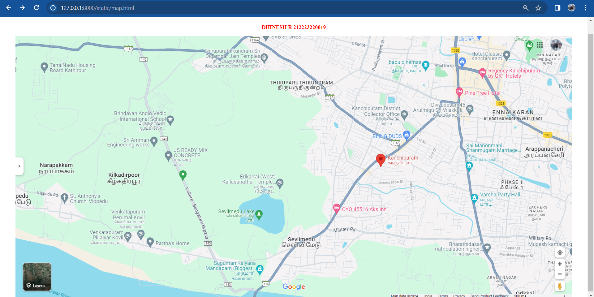

# Ex04 Places Around Me
## Date: 

## AIM
To develop a website to display details about the places around my house.

## DESIGN STEPS

### STEP 1
Create a Django admin interface.

### STEP 2
Download your city map from Google.

### STEP 3
Using ```<map>``` tag name the map.

### STEP 4
Create clickable regions in the image using ```<area>``` tag.

### STEP 5
Write HTML programs for all the regions identified.

### STEP 6
Execute the programs and publish them.

## CODE
```
map.html
<html>
    <head>
        <title>MY CITY</title>
    </head>
    <body>
        <h1 align="center">
            <font color="blue"><b>KANCHIPURAM</b></font>
        </h1>
        <h3 align="center">
            <font color="red"><b>JAYAKUMAR B 212223040073</b></font>

        </h3>
        <center>
            
            <map name="MyCity">
            <area shape="rect" coords="900,350,1000,450" href="temple.html" title="KAILASANATHAR TEMPLE">
            <area shape="rect" coords="850,450,970,500" href="school.html" title="BDMS School">
            <area shape="rect" coords="57,220,110,270" href="college.html" title="BHAKTHAVATSALAM POLYTECHNIC COLLEGE">
            <area shape="rect" coords="750,180,820,250" href="cinema.html" title="BABU CINEMAS">
            <area shape="rect" coords="850,150,920,300" href="party.html" title="VARSHA PARTY HALL">
            </map>
        </center>
            </body>
            </html>
        
    </body>
</html>


temple.html

<!DOCTYPE html>
<html>
<head>
<title></title>
</head>
<body bgcolor="cyan">
<h1 align="center"><b>KANCHIPURAM</b></h1>
<h3 align="center"><b>Thiruparythikundram Murugar Temple</b></h3>
<hr size="3" color="white">
<p align="center">
<font face="Georgia" size="5">
 1)It is one of the six temples of Lord Muruga and is believed to be one of the most auspicious places for marriage, as legend has it that Lord Muruga married Goddess Devasena here. The rocks also feature Mahishasura Mardini, Karpaga Vinayagar, Andarabaranar, and Uggirar carvings.<br>
</p>
</body>
</html>

school.html

<!DOCTYPE html>
<html>
<head>
<title></title>
</head>
<body bgcolor="cyan">
<h1 align="center"><b>KANCHIPURAM</b></h1>
<h3 align="center"><b>BDMS SCHOOL</b></h3>
<hr size="3" color="white">
<p align="center">
<font face="Georgia" size="5">
 1)Bharathidasan Matriculation Higher Secondary School offers excellent education at a reasonable price. <br>
 2)It is located at orikkai,Kanchipuram.<br>
 3)It is very strict school.<br>
</p>
</body>
</html>


cinema.html

<!DOCTYPE html>
<html>
<head>
<title></title>
</head>
<body bgcolor="cyan">
<h1 align="center"><b>KANCHIPURAM</b></h1>
<h3 align="center"><b>BABU CINEMAS</b></h3>
<hr size="3" color="white">
<p align="center">
<font face="Georgia" size="5">
 1)Madam St, Pillaiyarpalayam, Kanchipuram, Tamil Nadu 631502.<br>
 2)Movie theatre with parking and refreshment facilities airing Indian language and Hollywood films.<br>
</p>
</body>
</html>

party.html

<!DOCTYPE html>
<html>
<head>
<title></title>
</head>
<body bgcolor="cyan">
<h1 align="center"><b>KANCHIPURAM</b></h1>
<h3 align="center"><b>VARSHA PARTY HALL</b></h3>
<hr size="3" color="white">
<p align="center">
<font face="Georgia" size="5">
 1)It is located at 584, Amirthammal nagar, velingapatrai, Tamil Nadu.<br>
 2)Established in the year 2016, Varsha Party Hall in Orikkai,Kanchipuram listed under Banquet Halls in Kanchipuram.<br>
</p>
</body>
</html>
```


## OUTPUT



## RESULT
The program for implementing image maps using HTML is executed successfully.
